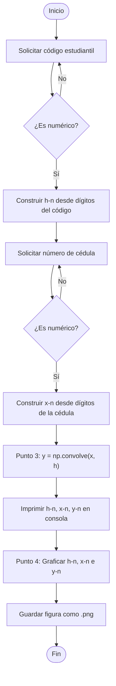
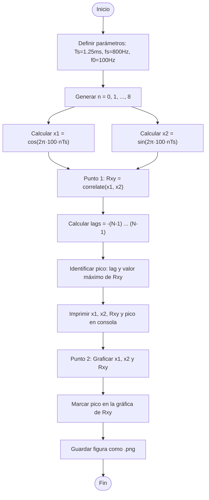
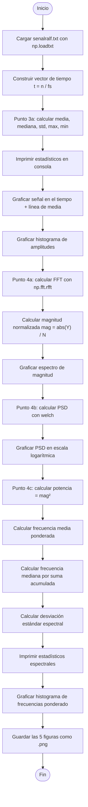

# laboratorio-2
# Convolución, correlación y transformada de Fourier.
# Objetivos general. 
Reconocer la importancia de la aplicación de herramientas matemáticas como la convolución y correlación en el área de procesamiento de señales, validando su comportamiento mediante cálculos manuales y simulaciones en Python.
# Objetivos especificos.
Comprender la convolución como una operación fundamental para obtener la respuesta de un sistema discreto ante una entrada determinada, validando los resultados mediante cálculos manuales (sumatorias) y herramientas de programación en Python.
Analizar la correlación cruzada como una medida de similitud entre secuencias discretas (seno y coseno), identificando su utilidad para caracterizar dependencias estadísticas en el procesamiento de señales.
Implementar la Transformada de Fourier para realizar un análisis espectral de señales biológicas, permitiendo la transición del dominio del tiempo al dominio de la frecuencia para su caracterización.
# Metodología del experimento.
## Fase de Análisis Matemático y Simulación (Convolución).
En esta etapa se busca contrastar el cálculo manual con el computacional.

Definición de secuencias: Se establecen las señales discretas  utilizando los dígitos del código estudiantil y la cédula de ciudadanía respectivamente.

Cálculo Analítico: Se aplica la sumatoria de convolución de forma manual para obtener la secuencia resultante y su representación gráfica.

Implementación en Python: Se desarrolla un script para ejecutar la misma operación y generar las gráficas secuenciales, permitiendo la validación de los resultados obtenidos a mano.

## Fase de Caracterización de Similitud (Correlación)
Esta fase se enfoca en el análisis de señales trigonométricas:Generación de señales, se definen las funciones con un periodo de muestreo.
Operación de Correlación se calcula la correlación cruzada entre ambas señales para medir su grado de similitud y se analiza la secuencia resultante de forma gráfica.
## Fase de Procesamiento de Señales Biológicas y Frecuencia.
Es la etapa de aplicación práctica con hardware y señales reales:

Adquisición: Se geenera una señal biológica mediante el generador de señales.

Digitalización: Se determina la frecuencia de Nyquist de la señal y se procede a su digitalización utilizando una frecuencia de muestreo de 4.

Análisis Estadístico: Se caracteriza la señal en el dominio del tiempo obteniendo medidas de tendencia central (media, mediana) y de dispersión (desviación estándar).

Análisis Espectral: Se aplica la Transformada de Fourier para trasladar la señal al dominio de la frecuencia, graficando su espectro y densidad espectral de potencia.

# Marco conceptual.
## Electrooculografía (EOG).
Es la técnica que mide la diferencia de potencial existente entre la córnea y la retina (potencial córneo-retiniano).
El ojo actúa como un dipolo donde la córnea es positiva y la retina es negativa. Se usa para registrar movimientos oculares. En procesamiento de señales, estas señales suelen estar contaminadas por ruido de 60 Hz o artefactos musculares (EMG), lo que justifica el uso de filtros (convolución).
## Convolución Discreta.
Es una operación matemática que combina dos señales  para producir una tercera señal. Se utiliza para determinar la respuesta de un sistema lineal e invariante en el tiempo (LTI) ante una entrada determinada.Aplicación Biomédica: Es la base del filtrado lineal; por ejemplo, para suavizar una señal de EOG y eliminar picos de ruido.
## Correlación Cruzada
Es una medida de la similitud entre dos señales en función del desplazamiento de una respecto a la otra. A diferencia de la  Convolución en la correlación no se invierte la señal en el tiempo.Sirve para caracterizar dependencias estadísticas entre dos secuencias.Es fundamental para detectar patrones o latencias, como comparar una señal de EOG actual con un patrón de parpadeo conocido.
## Transformada de Fourier (DFT/FFT)
Herramienta matemática que traslada una señal del dominio del tiempo al dominio de la frecuencia.
Permite analizar qué frecuencias componen la señal biológica. Densidad Espectral de Potencia (PSD), indica cómo se distribuye la potencia de la señal sobre las diferentes frecuencias, crucial para identificar ritmos biológicos.
## Teorema de Muestreo de Nyquist
Establece que para reconstruir una señal analógica a partir de sus muestras, la frecuencia de muestreo debe ser al menos el doble de la frecuencia máxima de la señal .
En la práctica: La guía sugiere digitalizar a 4 veces la frecuencia de Nyquist para evitar el aliasing y garantizar una caracterización precisa en el dominio de la frecuencia.
## Estadísticos en Frecuencia
Para señales biológicas, no basta con la media temporal; se requieren medidas espectrales:Frecuencia Media: El promedio de las frecuencias ponderado por su potencia.Frecuencia Mediana: La frecuencia que divide el espectro de potencia en dos partes iguales.

# Adquisición de la señal.
Para esta práctica se trabajó con una señal de electrooculografía (EOG), la cual registra los movimientos oculares midiendo la diferencia de potencial entre la córnea y la retina.
Materiales

Data Acquisition (DAQ)
Generador de señales fisiológicas
Osciloscopio
Cables de conexión

Procedimiento
El DAQ fue conectado al generador de señales y a la entrada USB del computador. La señal fue visualizada en el osciloscopio para verificar su forma de onda antes de proceder con la digitalización. Una vez confirmada la señal, se procedió a capturarla y almacenarla desde Python usando la librería nidaqmx.
Los parámetros de adquisición fueron:
ParámetroValorFrecuencia de muestreo (fs)1000 HzDuración10 sTotal de muestras10 000CanalDev1/ai0
Código de adquisición

```cpp
pythonimport nidaqmx
import numpy as np
import matplotlib.pyplot as plt
from nidaqmx.constants import AcquisitionType

fs       = 1000
duracion = 10
dispositivo    = 'Dev1/ai0'
total_muestras = int(fs * duracion)

with nidaqmx.Task() as task:
    task.ai_channels.add_ai_voltage_chan(dispositivo)
    task.timing.cfg_samp_clk_timing(
        fs,
        sample_mode=AcquisitionType.FINITE,
        samps_per_chan=total_muestras
    )
    senal = task.read(number_of_samples_per_channel=total_muestras)

t = np.arange(len(senal)) / fs
plt.plot(t, senal)
plt.title(f"Señal EOG — fs={fs} Hz | duración={duracion} s | muestras={len(senal)}")
plt.xlabel("Tiempo (s)")
plt.ylabel("Amplitud (V)")
plt.grid()
plt.show()

np.savetxt("senalralf.txt", senal)
```
 Autor Del Código: Carolina Corredor.
 
 Fecha: 2025-09-09.
 
La señal capturada fue guardada en senalralf.txt y es la que se utiliza en la Parte C para el análisis estadístico y espectral.

## Parte A
### Manual


### python
## Parte A — Convolución

### Python

Para los puntos 3 y 4 se desarrolló un script en Python que solicita los datos personales del estudiante al momento de ejecutarse, por lo que funciona para cualquier usuario sin necesidad de modificar el código.

El script construye las señales `h[n]` y `x[n]` a partir de los dígitos del código estudiantil y la cédula respectivamente, calcula la convolución usando `np.convolve` y genera una figura con las tres señales: el sistema, la entrada y el resultado.

**Librerías utilizadas:** `numpy`, `matplotlib`

**Ejecución:**

```bash
python parteA_convolucion.py
```

Al ejecutarlo, el programa pide:

```
Código estudiantil: 5600773
Número de cédula: 1023163602
```

Y genera la siguiente salida en consola:

```
h[n] = [5, 6, 0, 0, 7, 7, 3]
x[n] = [1, 0, 2, 3, 1, 6, 3, 6, 0, 2]

Longitud de y[n] = 10 + 7 - 1 = 16
y[n] = [5, 6, 10, 27, 30, 43, 68, 83, 70, 68, 78, 81, 51, 32, 14, 6]
```
Junto a esta grafica:


### Diagrama de flujo

## Parte B
### Manual


### ¿En qué situaciones resulta útil aplicar la correlación cruzada en el procesamiento digital de señales? 

En procesamiento de señales biomédicas, sirve para reconocer una forma de onda específica (como un latido cardíaco) dentro de una señal ruidosa al compararla con un patrón de referencia.


### python
Para los puntos 1 y 2 se desarrolló un script que define las señales x1[nTs] y x2[nTs] con los parámetros dados, calcula la correlación cruzada usando correlate de scipy e identifica el pico para determinar el desfase entre ambas señales. Genera una figura con las tres secuencias: las dos señales de entrada y la correlación resultante.
Librerías utilizadas: numpy, matplotlib, scipy.signal
Ejecución:
python parteB_correlacion.py

Salida en consola al ejecutarlo:
```
Ts = 0.00125 s  |  fs = 800.0 Hz  |  f0 = 100 Hz

Pico máximo en lag = 2
Valor del pico = 3.5
```
Junto a esta grafica:


### Diagrama de flujo


## Parte C
# Puntos resueltos con Python
- **3a.** Estadísticos en el dominio del tiempo
- **4a.** Transformada de Fourier
- **4b.** Densidad espectral de potencia
- **4c.** Estadísticos en el dominio de la frecuencia

> Los puntos 1, 2 y 3b se desarrollan de forma analítica en el informe.

## Punto 1 — Frecuencia de Nyquist

La señal EOG tiene componentes frecuenciales relevantes por debajo de 500 Hz. Dado que la frecuencia de muestreo utilizada fue `fs = 1000 Hz`, la frecuencia de Nyquist es:

$$f_{Nyquist} = \frac{f_s}{2} = \frac{1000}{2} = 500 \text{ Hz}$$

## Punto 2 — Digitalización

Se usó `fs = 1000 Hz`, equivalente a 4 veces la frecuencia de Nyquist del contenido útil de la señal (~250 Hz para EOG), cumpliendo el criterio de la guía. La señal fue capturada con el DAQ durante 10 segundos obteniendo 10 000 muestras almacenadas en `senalralf.txt`.

## Punto 3a — Estadísticos en el dominio del tiempo

| Estadístico | Valor |
|-------------|-------|
| Media | `-0.0360` |
| Mediana | `-0.0347` |
| Desviación estándar | `0.1437` |
| Máximo | `0.4082` |
| Mínimo | `-0.5458` |

La media ligeramente negativa indica un pequeño offset DC en la señal, común en registros EOG. La desviación estándar baja frente a los picos confirma que los eventos oculares son esporádicos, comportamiento esperado para este tipo de señal.

# Punto 3b — Clasificación de la señal

| Criterio | Clasificación | Justificación |
|----------|--------------|---------------|
| Determinismo | Aleatoria | Señal biológica con fluctuaciones impredecibles dependientes del movimiento ocular |
| Periodicidad | Cuasi-periódica | Oscilaciones repetitivas pero no idénticas, típico de señales fisiológicas |
| Naturaleza | Digital | Discretizada por el ADC del DAQ a 1000 muestras por segundo |

# Punto 4c — Estadísticos en el dominio de la frecuencia

| Estadístico | Valor |
|-------------|-------|
| Frecuencia media | `9.50 Hz` |
| Frecuencia mediana | `4.00 Hz` |
| Desviación estándar | `32.13 Hz` |

La mayor parte de la energía se concentra por debajo de 20 Hz, consistente con señales EOG donde los movimientos oculares lentos dominan el espectro. La diferencia entre frecuencia media y mediana indica la presencia de componentes de alta frecuencia con baja potencia que desplazan la media hacia arriba.

### python

El script carga la señal desde `senalralf.txt`, calcula los estadísticos en el dominio del tiempo y aplica la FFT junto con el método de Welch para el análisis espectral. Genera 5 figuras independientes: la señal en el tiempo, el histograma de amplitudes, el espectro de magnitud, la PSD y el histograma de frecuencias ponderado por potencia.

**Librerías:** `numpy`, `matplotlib`, `scipy.signal`

**Salida en consola:**

```
PARTE C — Señal EOG

Muestras: 10000
Frecuencia de muestreo: 1000 Hz
Duración: 10.0 s

Estadísticos de la señal

  Media:               -0.0360
  Mediana:             -0.0347
  Desviación estándar:  0.1437
  Máximo:               0.4082
  Mínimo:              -0.5458

FFT calculada
  Resolución: 0.1000 Hz

PSD calculada usando método Welch

Estadísticos espectrales

  Frecuencia media:      9.5001 Hz
  Frecuencia mediana:    4.0000 Hz
  Desviación estándar:   32.1327 Hz
```


### Diagrama de flujo


# Análisis de resultados.

## Análisis 1 — Convolución y correlación en señales biomédicas

**Alcances:**

La convolución es la base del filtrado digital lineal. En señales EOG, permite diseñar filtros FIR que eliminan ruido de alta frecuencia (artefactos musculares EMG o interferencia de 60 Hz) sin distorsionar los componentes de baja frecuencia donde reside la información útil del movimiento ocular. Su implementación es directa, computacionalmente eficiente y su comportamiento es completamente predecible al ser una operación determinística.

La correlación cruzada permite detectar patrones conocidos dentro de una señal biológica. Por ejemplo, comparar una ventana de señal EOG con un patrón de parpadeo de referencia para identificar eventos oculares automáticamente. También es útil para medir el desfase entre dos canales de registro simultáneo, como en EEG multicanal o en sistemas de seguimiento ocular binocular.

**Limitaciones:**

La convolución asume que el sistema es lineal e invariante en el tiempo (LTI), condición que las señales biológicas no siempre cumplen ya que sus características cambian con el estado fisiológico del paciente. Además, al operar con señales finitas introduce efectos de borde en los extremos de la secuencia resultante que pueden distorsionar el análisis.

La correlación cruzada es sensible al ruido: si la señal está muy contaminada, el pico de correlación pierde precisión y puede conducir a detecciones erróneas. Tampoco captura relaciones no lineales entre señales, lo que limita su uso en señales biológicas complejas como el EEG durante episodios epilépticos.

---

## Análisis 2 — Transformada de Fourier en aplicaciones en tiempo real

**Alcances:**

La FFT permite identificar con precisión las componentes frecuenciales de una señal biológica, algo imposible de determinar solo observando la señal en el tiempo. En una señal EOG como la analizada, revela que la energía se concentra por debajo de 20 Hz, lo que permite diseñar filtros adecuados y descartar componentes de alta frecuencia que corresponden a ruido. El método de Welch además estabiliza la estimación de la PSD promediando segmentos solapados, reduciendo la varianza del espectro.

**Limitaciones:**

La DFT/FFT asume que la señal es estacionaria, es decir, que sus propiedades estadísticas no cambian en el tiempo. Las señales biológicas en general son no estacionarias: un EOG varía según si el paciente está en reposo, leyendo o durmiendo. Aplicar la FFT sobre toda la señal entrega un espectro promedio que puede ocultar cambios espectrales importantes.

Para aplicaciones en tiempo real existe un compromiso inevitable entre resolución frecuencial y latencia: una FFT de `N` puntos tiene una resolución de `fs/N` Hz pero introduce una latencia mínima de `N/fs` segundos. Con `fs = 1000 Hz` y `N = 10000`, la resolución es de `0.1 Hz` pero la latencia sería de 10 segundos, inaceptable para un sistema de tiempo real. En la práctica se usan ventanas deslizantes cortas (`N` pequeño) sacrificando resolución frecuencial.

# Conclusiones.


A lo largo de esta práctica se comprobó que la convolución, la correlación cruzada y la Transformada de Fourier son herramientas complementarias para el análisis de señales biomédicas, cada una con un rol distinto y bien definido.

La convolución demostró ser una operación fundamental para el filtrado de señales discretas. La validación entre el cálculo manual por sumatorias y el resultado de `np.convolve` confirmó la equivalencia entre ambos métodos y afianzó la comprensión de la operación matemática subyacente. En el contexto biomédico, esta herramienta es directamente aplicable al diseño de filtros para limpiar señales EOG, ECG o EEG contaminadas por ruido, lo que impacta directamente en la calidad del diagnóstico clínico.

La correlación cruzada entre las señales coseno y seno evidenció el desfase de 90° entre ambas a través del pico en `lag = 2`, correspondiente a 2.5 ms. Este resultado ilustra cómo la correlación puede detectar relaciones temporales entre señales, una capacidad útil para identificar latencias en sistemas de conducción nerviosa o reconocer patrones de parpadeo en señales EOG ruidosas.

El análisis espectral de la señal EOG mediante FFT y PSD reveló que la mayor parte de la energía se concentra por debajo de 20 Hz, con una frecuencia media de 9.5 Hz y mediana de 4 Hz. Este resultado es consistente con el comportamiento fisiológico esperado para movimientos oculares y confirma que la señal fue adquirida correctamente. La diferencia entre media y mediana espectral sugiere además la presencia de componentes de ruido de alta frecuencia y baja potencia que elevan la media sin afectar significativamente la mediana, lo que orientaría el diseño de un filtro pasa-bajos con frecuencia de corte alrededor de 40 Hz para preservar la información clínicamente relevante.

En conjunto, estas técnicas constituyen la base del procesamiento digital de señales biomédicas y su dominio es esencial para el desarrollo de sistemas de monitoreo, diagnóstico asistido y dispositivos médicos.

# PREGUNTAS PARA LA DISCUSIÓN
## ¿Qué utilidad poseen herramientas como la convolución y la correlación en áreas como procesamiento de imágenes?
Convolución: Se utiliza principalmente para el filtrado digital. Al aplicar una matriz pequeña (llamada núcleo o kernel) sobre la imagen, se pueden lograr efectos como el suavizado (reducción de ruido), el realce de bordes (detección de contornos) o el desenfoque. Es la base de las Redes Neuronales Convolucionales (CNN) para visión artificial.

Correlación: Su principal uso es el reconocimiento de patrones (Template Matching). Permite buscar una imagen pequeña (patrón) dentro de una más grande. El punto donde la correlación es máxima indica la ubicación exacta donde se encuentra el objeto buscado.

## ¿En cuáles contextos de aplicación la transformada de Fourier ofrece un conjunto de características con mayor poder discriminativo que las quesuelen considerarse desde el dominio temporal?
Identificación de ritmos biológicos: En señales como el EEG o el ECG, es más fácil identificar patologías observando picos en frecuencias específicas (como el ritmo alfa o arritmias) que analizando la señal cruda en el tiempo.

Eliminación de ruido periódico: Si una señal tiene interferencia de la red eléctrica (60 Hz), en el dominio del tiempo el ruido se mezcla con la señal, pero en el dominio de la frecuencia aparece como un pico aislado muy fácil de identificar y filtrar.

Compresión de datos: Permite identificar qué componentes de frecuencia tienen poca energía y pueden eliminarse sin perder información vital, algo imposible de determinar solo viendo la señal temporal.

## ¿En qué se diferencia la correlación cruzada de la convolución? 
Inversión de la señal: En la convolución, una de las señales se debe invertir en el tiempo (reflejar) antes de deslizarla y sumar. En la correlación cruzada, las señales se comparan directamente sin invertir ninguna.
Propiedad de conmutatividad: La convolución es conmutativa, pero la correlación cruzada no lo es; el orden de las señales cambia el resultado del desplazamiento.

# Declaración de uso de herramientas de IA

Durante la elaboración de este laboratorio se utilizaron herramientas de inteligencia artificial basadas en modelos de lenguaje como apoyo en tareas de consulta, revisión de redacción y organización del código.

Estas herramientas se emplearon únicamente como asistencia técnica para estructuración del documento, aclaración de conceptos y verificación de implementaciones en Python.

Los diagramas de flujo fueron generados inicialmente mediante herramientas compatibles con **Mermaid**, y posteriormente ajustados para representar la lógica del programa.

