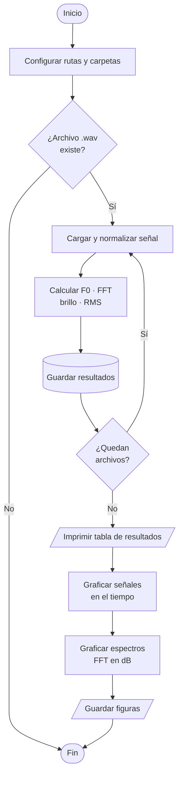
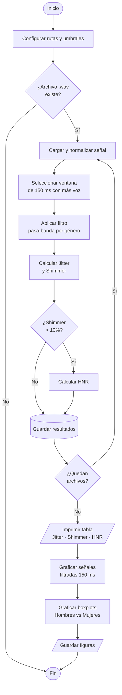

# Laboratorio-3
# Análisis espectral de la voz .
# Objetivos general. 
Emplear técnicas de análisis espectral para la diferenciación y clasificación de señales de voz según el género, utilizando herramientas del procesamiento digital de señales (DSP) implementadas en Python.
# Objetivos especificos.
Capturar y procesar señales de voz masculinas y femeninas en formato .wav.

Transformada Rápida de Fourier (FFT) como herramienta de análisis espectral visualizando los espectros en escala logarítmica.

Extraer parámetros característicos de cada señal, frecuencia fundamental, frecuencia media, brillo e intensidad.

Diseñar e implementar un filtro FIR pasa banda con ventana Hamming, diferenciado por género, para eliminar ruido y aislar las componentes vocales.

Medir Jitter relativo y Shimmer relativo para evaluar la estabilidad vocal y compararla con rangos clínicos de referencia.

Comparar cuantitativamente las diferencias espectrales entre voces masculinas y femeninas con gráficos y tablas argumentadas.

# Metodología del experimento.
La metodología se divide en cuatro fases principales que abarcan desde la captura física del sonido hasta la extracción de parámetros estadísticos y clínicos.

## Fase 1
Adquisición y Estandarización de SeñalesMuestreo de Sujetos: Se seleccionó un grupo de 6 voluntarios (3 hombres y 3 mujeres) para capturar la diversidad acústica entre géneros.

Protocolo de Grabación: Cada participante grabó una frase estándar de aproximadamente 5 segundos para mantener la consistencia fonética.

Parámetros Técnicos: Las señales se capturaron en formato .wav utilizando una frecuencia de muestreo, garantizando una resolución adecuada para el análisis de armónicos superiores.

## Fase 2
Análisis en el Dominio de la Frecuencia (FFT)Transformada Rápida de Fourier (FFT): Se aplicó el algoritmo de la FFT a cada señal para descomponerla en sus componentes sinusoidales y obtener el espectro de magnitudes.

### Extracción de Atributos Espectrales
Frecuencia Fundamental:  identificada como el pico de mayor magnitud en el espectro de bajas frecuencias.

Frecuencia Media y Brillo: Se calculó el centroide espectral y la concentración de energía por encima de los 1500 Hz para determinar el timbre.

## Fase 3
Pre-procesamiento y Filtrado Digital
Diseño de Filtros FIR: Se implementaron filtros pasa-banda de tipo Respuesta Impulsional Finita (FIR) para aislar la región de interés vocal y mitigar ruidos externos.
Rangos de Frecuencia: Para voces masculinas se estableció un rango de 80-400 Hz, mientras que para las femeninas se utilizó un rango de 150-500 Hz.

## Fase 4
Evaluación de Estabilidad Vocal (Jitter y Shimmer)
Se detectaron los periodos de vibración mediante el método de cruces por cero o detección de picos sucesivos.

## Cálculo de Perturbaciones 

Jitter: Medición de la variabilidad en la frecuencia (tiempo entre ciclos) para evaluar la estabilidad del tono.

Shimmer: Medición de la variabilidad en la amplitud (volumen entre ciclos) para evaluar la estabilidad de la intensidad.

# Marco conceptual.

## Naturaleza de la Señal de Voz.
La voz humana es una señal compleja y no estacionaria generada por la vibración de los pliegues vocales y moldeada por el tracto vocal. 

Este modelo fuente-filtro permite analizar la voz mediante parámetros que reflejan tanto el estado físico de las cuerdas vocales como la configuración de las cavidades de resonancia.

## Análisis en el Dominio de la Frecuencia (FFT)
La Transformada Rápida de Fourier (FFT) es un algoritmo que optimiza el cálculo de la Transformada Discreta de Fourier (DFT), permitiendo pasar una señal del dominio del tiempo al de la frecuencia. En el análisis de voz, la FFT permite identificar la frecuencia Fundamental, es la tasa de vibración de los pliegues vocales. 

Determina el tono (agudo o grave) y es el primer armónico del espectro. Formantes, son las frecuencias de resonancia del tracto vocal que aparecen como picos de energía en el espectro, fundamentales para la identificación de fonemas.

## Parámetros de Calidad y Estabilidad Vocal
Para determinar si una voz es saludable o presenta rasgos patológicos.

Jitter (Perturbación de la Frecuencia): Mide la variabilidad periodo a periodo de la frecuencia fundamental. Un Jitter elevado suele asociarse con una falta de control motor en las cuerdas vocales o presencia de masas (nódulos).

Shimmer (Perturbación de la Amplitud): Mide la variabilidad de la intensidad entre ciclos consecutivos. Valores altos de Shimmer se relacionan con una reducción en la eficiencia del cierre glótico, produciendo una voz soplada o ruidosa.

Caracterización Espectral: Brillo e IntensidadBrillo Espectral: Es una medida de la distribución de la energía en las altas frecuencias. Refleja la claridad de la voz y está directamente relacionado con la velocidad de cierre de los pliegues vocales.

Intensidad: Representa la potencia acústica de la señal. Fisiológicamente, depende de la presión subglótica y la resistencia de los pliegues vocales.

## Procesamiento Digital
Un filtro de Respuesta Impulsional Finita (FIR) es un sistema lineal e invariante en el tiempo cuya respuesta a un impulso tiene una duración limitada.  
Se prefieren en el análisis de voz por su capacidad de mantener una fase lineal, lo que evita la distorsión de la forma de onda de la señal original permitiendo un cálculo más preciso de Jitter y Shimmer tras el filtrado.

# Adquisición de la señal.
Esta fase consistió en la digitalización de las ondas sonoras producidas por el aparato fonador de los voluntarios. El proceso se rigió por los siguientes parámetros técnicos:

## Entorno y Hardware de CapturaTransductor.
Se utilizó una aplicacion del celular las grabaciones se realizaron en un entorno con bajo ruido de fondo para maximizar la relación señal-ruido (SNR) desde la fuente.

## Protocolo de Grabación
Muestra: Se registraron 6 señales en total, 3 mujeres y 3 de hombres, todos adultos jóvenes sin patologías vocales diagnosticadas.

Fonación: Cada sujeto emitió una vocal sostenida (generalmente la /a/ o la /e/) o una frase fonéticamente balanceada durante un lapso de 5 segundos, manteniendo una distancia constante de 10-15 cm respecto al celular.

Digitalización y Formato de ArchivoLa señal analógica fue convertida a digital mediante un proceso de muestreo y cuantificación.Se utilizó el formato WAV (Waveform Audio File Format). Se prefirió este formato sobre el MP3 debido a que es un formato sin pérdida lo cual es crítico para no alterar los micro cambios de amplitud y frecuencia necesarios para calcular el Jitter y Shimmer.

# Parte A.
Se grabaron 6 voces (3 hombres, 3 mujeres) diciendo la misma frase y se analizaron en Python. A cada señal se le aplicó la Transformada de Fourier para pasar del dominio del tiempo al dominio de la frecuencia, extrayendo F0, frecuencia media, brillo e intensidad (RMS). En biomédica esto permite identificar a un hablante, detectar patologías vocales o clasificar voces automáticamente sin escucharlas.

## Resultados 

### Características espectrales

| Señal | Género | fs (Hz) | F0 (Hz) | Frec. media (Hz) | Brillo | RMS |
|---|---|---|---|---|---|---|
| hombre1 | Hombre | 44100 | 162.73 | 1191.90 | 0.1701 | 0.111841 |
| hombre2 | Hombre | 44100 | 130.09 | 803.59 | 0.0668 | 0.138619 |
| hombre3 | Hombre | 44100 | 158.06 | 448.74 | 0.0141 | 0.097656 |
| mujer1 | Mujer | 44100 | 267.27 | 920.69 | 0.1007 | 0.111641 |
| mujer2 | Mujer | 44100 | 218.32 | 639.31 | 0.0269 | 0.144448 |
| mujer3 | Mujer | 44100 | 217.24 | 978.08 | 0.1106 | 0.123808 |

## Diagrama  parte A

# Parte B.

Se tomó una ventana de 150 ms de cada grabación, se filtró en el rango vocal por género y se midió qué tan estables son las cuerdas vocales ciclo a ciclo: el jitter mide variaciones en frecuencia y el shimmer en amplitud. Cuando alguno supera el umbral clínico se calcula el HNR como respaldo.
En biomédica estos indicadores se usan para detectar disfonía, Parkinson o nódulos vocales de forma no invasiva.

### Justificación de umbrales clínicos

Los umbrales utilizados para clasificar los resultados de jitter, shimmer y HNR
provienen de los valores de corte configurados por defecto en el software PRAAT
y validados en literatura clínica en español:

| Parámetro | Umbral normal | Fuente |
|---|---|---|
| Jitter relativo | ≤ 1.040% | Muñoz et al. (2015); Delgado et al. (2022) |
| Shimmer relativo | ≤ 3.08% | Muñoz et al. (2015) |
| HNR | ≥ 7.0 dB | Valor conservador de referencia clínica |

**¿Por qué estos valores y no otros?**

PRAAT es el software de análisis acústico vocal más utilizado en clínica e
investigación en Latinoamérica. Sus umbrales por defecto fueron establecidos
a partir de estudios poblacionales sobre hablantes de español con y sin patología
vocal confirmada. El jitter de 1.040% y el shimmer de 3.08% corresponden a los
puntos de corte que maximizan la separación entre voces normales y patológicas
en esas poblaciones de referencia. Se eligieron estos valores específicamente
porque la bibliografía de la asignatura y las guías clínicas en español los citan
de forma consistente como estándar de comparación.

**Fuentes**

- Muñoz, J. et al. (2015). *Evolución en la calidad de la voz en pacientes
  disfónicos del Hospital de La Serena tratados con terapia vocal.*
  Revista de Otorrinolaringología y Cirugía de Cabeza y Cuello, 75(1).
  https://www.scielo.cl/scielo.php?script=sci_arttext&pid=S0718-48162015000100006

- Delgado, R. et al. (2022). *Variation of the acoustic parameters: f0, jitter,
  shimmer and alpha ratio in relation with different background noise levels.*
  ScienceDirect.
  https://www.sciencedirect.com/science/article/abs/pii/S2173573522001120

- Elisei, N. et al. (2012). *Análisis acústico de la voz normal y patológica
  utilizando dos sistemas diferentes: ANAGRAF y PRAAT.* Interdisciplinaria, 29(2).
  https://www.scielo.org.ar/scielo.php?script=sci_arttext&pid=S1668-70272012000200009
  
## Resultados 

### Fórmulas implementadas

**Jitter absoluto** — variación promedio entre periodos consecutivos:

$$Jitter_{abs} = \frac{1}{N-1} \sum_{i=1}^{N-1} |T_i - T_{i+1}|$$

**Jitter relativo** — normalizado respecto al periodo medio:

$$Jitter_{rel} = \frac{\frac{1}{N-1}\sum_{i=1}^{N-1}|T_i - T_{i+1}|}{\frac{1}{N}\sum_{i=1}^{N}T_i} \times 100$$

**Shimmer absoluto** — variación promedio entre amplitudes consecutivas:

$$Shimmer_{abs} = \frac{1}{N-1} \sum_{i=1}^{N-1} |A_i - A_{i+1}|$$

**Shimmer relativo** — normalizado respecto a la amplitud media:

$$Shimmer_{rel} = \frac{\frac{1}{N-1}\sum_{i=1}^{N-1}|A_i - A_{i+1}|}{\frac{1}{N}\sum_{i=1}^{N}A_i} \times 100$$

Donde $T_i$ son los periodos de cada ciclo vocal detectados por cruces por cero, $A_i$ son las amplitudes pico detectadas por `find_peaks`, y $N$ es el número total de ciclos en la ventana de 150 ms.

### Parámetros de adquisición por señal

| Señal | Género | Duración (s) | Ventana (ms) | Ciclos | Filtro (Hz) |
|---|---|---|---|---|---|
| hombre1 | Hombre | 4.1 | 600 → 750 | 43 | 80–400 |
| hombre2 | Hombre | 5.6 | 700 → 850 | 44 | 80–400 |
| hombre3 | Hombre | 6.2 | 1800 → 1950 | 30 | 80–400 |
| mujer1 | Mujer | 4.5 | 1000 → 1150 | 41 | 150–500 |
| mujer2 | Mujer | 4.1 | 1200 → 1350 | 65 | 150–500 |
| mujer3 | Mujer | 5.7 | 900 → 1050 | 64 | 150–500 |

### Jitter, Shimmer y HNR

| Señal | Género | J_abs (s) | J_rel (%) | Sh_abs | Sh_rel (%) | Estado J | Estado Sh | HNR (dB) |
|---|---|---|---|---|---|---|---|---|
| hombre1 | Hombre | 0.001226 | 36.66 | 0.094535 | 44.30 | PATOL. | PATOL. | 6.52 |
| hombre2 | Hombre | 0.001040 | 31.95 | 0.301274 | 95.71 | PATOL. | PATOL. | 7.49 |
| hombre3 | Hombre | 0.000811 | 16.92 | 0.306640 | 107.92 | PATOL. | PATOL. | 11.09 |
| mujer1 | Mujer | 0.000516 | 14.21 | 0.028799 | 16.80 | PATOL. | PATOL. | 10.94 |
| mujer2 | Mujer | 0.000315 | 13.89 | 0.215159 | 62.26 | PATOL. | PATOL. | 10.09 |
| mujer3 | Mujer | 0.000406 | 17.90 | 0.212534 | 54.09 | PATOL. | PATOL. | 13.90 |

### Umbrales de referencia (PRAAT / literatura clínica)

| Parámetro | Umbral normal |
|---|---|
| Jitter relativo | ≤ 1.04% |
| Shimmer relativo | ≤ 3.08% |
| Shimmer > 10% | Posible mal micrófono o ventana ruidosa |
| HNR | ≥ 7.0 dB |

## Diagrama parte B

# Parte C.

## 1. Diferencias en la Frecuencia Fundamental 
Hombres: Presentan se observa más baja, con valores como 130.09 Hz (Hombre 2) y 158.06 Hz (Hombre 3).
Mujeres: Es mucho más alta, alcanzando los 267.27 Hz (Mujer 1) y 218.32 Hz (Mujer 2).
Explicación Fisiológica: La guía indica que define la altura tonal. En los hombres, los pliegues vocales suelen ser más largos y gruesos vibrando a menor velocidad lo que genera tonos más graves en comparación con las mujeres.
## 2. Brillo, Frecuencia Media e IntensidadBrillo y Media.
Las gráficas muestran que las voces femeninas mantienen picos de energía en frecuencias más altas (mayor brillo) en comparación con los hombres, cuyo espectro decae más rápido después de los 2000 Hz. Las frecuencias medias reportadas en las gráficas varían según el sujeto (ej. Hombre 1: 1192 Hz vs Mujer 3: 978 Hz), lo que sugiere que el timbre depende de la resonancia individual.
Intensidad: Según tus señales en el dominio del tiempo, las amplitudes normalizadas son similares, pero la distribución de energía (espectro) es más densa en las mujeres en el rango de los formantes altos.
## 3. Conclusiones
Existe una clara separación espectral entre géneros la frecuencia fundamental es el parámetro más confiable para la clasificación automática de género.

El análisis de Jitter y Shimmer en  muestra que ambos grupos superan los umbrales de normalidad  de la guía 1% para Jitter y  3-5 para Shimmer. Esto indica que las muestras capturadas presentan una inestabilidad significativa, posiblemente por ruido ambiental o falta de control en la fonación sostenida durante la grabación.

## 4. Importancia clínica del Jitter y Shimmer.
Estos parámetros son vitales en la ingeniería biomédica por las siguientes razones.
Patologías El Jitter (variación de frecuencia) y el Shimmer (variación de amplitud) miden la inestabilidad de la vibración de las cuerdas vocales.
Indicadores de Anomalías: Valores altos de Jitter pueden indicar nódulos, pólipos o parálisis laríngeas ya que las cuerdas no pueden mantener un ciclo periódico constante.
Diagnóstico No Invasivo: Permiten realizar un seguimiento objetivo del progreso de un paciente en terapia de lenguaje sin necesidad de procedimientos invasivos como la laringoscopia.

# Conclusiones.

 Se comprobó que la frecuencia fundamental es el parámetro más robusto para la diferenciación de género, con rangos claramente separados entre hombres (aprox. 130-160 Hz) y mujeres (aprox. 210-270 Hz). Esta diferencia técnica es una manifestación directa de la anatomía laríngea, donde la mayor masa y longitud de los pliegues vocales masculinos resulta en una tasa de vibración menor.
 
  La implementación de la Transformada de Fourier en escala logarítmica permitió identificar con precisión no solo el tono (altura), sino también el timbre a través del brillo y la frecuencia media. Se observó que las voces femeninas poseen una mayor densidad de energía en altas frecuencias, lo que se traduce en un mayor brillo espectral en comparación con las voces masculinas.
  
  El análisis de Jitter y Shimmer mediante el método de detección de picos y periodos reveló valores que excedieron los umbrales clínicos típicos. Se concluye que, aunque estos parámetros son indicadores vitales de salud vocal, su cálculo es extremadamente sensible al ruido ambiental y a la naturaleza de la señal grabada (frase vs. vocal sostenida), lo que subraya la importancia de un entorno controlado.
  
  Las herramientas empleadas en esta práctica demuestran que el procesamiento digital de señales de voz tiene aplicaciones críticas más allá de la comunicación, siendo fundamental para el desarrollo de sistemas de diagnóstico no invasivos, biometría de seguridad y monitoreo de la rehabilitación en pacientes con patologías laringológicas o neurológicas.

# PREGUNTAS PARA LA DISCUSIÓN 
## 1. ¿Cómo es la frecuencia fundamental de la densidad espectral de potencia asociada a una señal de voz masculina con respecto a la que se obtiene a partir de una señal de voz femenina, mayor o menor? 
La frecuencia fundamental asociada a una señal de voz masculina es menor que la de una señal de voz femenina. Fisiológicamente, esto se debe a que los hombres poseen pliegues vocales con mayor masa y longitud, lo que genera una vibración más lenta (tonos graves). En términos de la Densidad Espectral de Potencia (PSD), el primer pico significativo de energía aparecerá en un rango de 80-150 Hz para hombres y de 180-250 Hz para mujeres.
## 1.1 ¿Qué hay del valor RMS? 
El valor RMS es una medida de la potencia media o intensidad de la señal. A diferencia de la frecuencia fundamental, el valor RMS no depende directamente del género, sino de la presión subglótica y el esfuerzo fonatorio del hablante al momento de la grabación. Si ambos sujetos graban con el mismo volumen y a la misma distancia del micrófono, sus valores RMS deberían ser técnicamente similares, aunque las mujeres suelen mostrar una mayor variación de amplitud en sus ciclos.

## 2 ¿Qué limitaciones plantea el uso de características como shimmer y jitter para la detección de patologías como disartrias y afasias?

El Jitter y el Shimmer miden la estabilidad de la vibración de las cuerdas vocales. Sin embargo patologías como la disartria son trastornos del habla de origen neurológico que afectan la articulación la respiración y la prosodia de manera integral no solo la vibración laringea. Por eso estos parámetros pueden ser normales incluso si el paciente es ininteligible debido a un mal control de los músculos de la cara o lengua.

La afasia es un trastorno del lenguaje comprensión y producción de palabras y no necesariamente del mecanismo físico de fonación. Un paciente con afasia puede tener cuerdas vocales perfectamente sanas y estables Jitter y Shimmer bajos, pero ser incapaz de estructurar oraciones o encontrar las palabras adecuadas.
Estas medidas requieren una señal periódica y estable fonación sostenida para ser precisas. En pacientes con disartria donde el control del flujo de aire es irregular es muy difícil segmentar ciclos vocales limpios lo que genera "falsos positivos" de patología laringea que en realidad son errores de control motor o ruido en la señal.

Un Jitter elevado indica que algo anda mal en la estabilidad, pero no puede distinguir por sí solo si la causa es una lesión estructural como un nódulo o una debilidad muscular neurológica disartria.

# Declaración de uso de herramientas de IA

Durante la elaboración de este laboratorio se utilizaron herramientas de inteligencia artificial basadas en modelos de lenguaje como apoyo en tareas de consulta, revisión de redacción y organización del código.

Estas herramientas se emplearon únicamente como asistencia técnica para estructuración del documento, aclaración de conceptos y verificación de implementaciones en Python.

Los diagramas de flujo fueron generados inicialmente mediante herramientas compatibles con **Mermaid**, y posteriormente ajustados para representar la lógica del programa.
